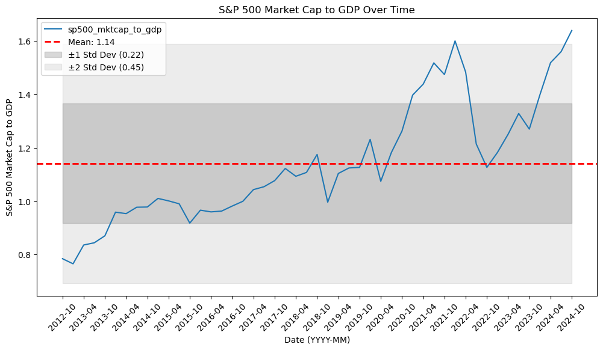

# gdp

## Purpose:
- This project pulls common gdp data from FRED (Federal Reserve Economic Data) and S&P 500 total market cap.
- It outputs several GDP series from the Federal Reserve
- It also outputs a S&P500 total market cap to GDP ratio that as of February 2025 is outside the 2nd standard deviation. 
- Highly valued relative to its history over the years shown.

